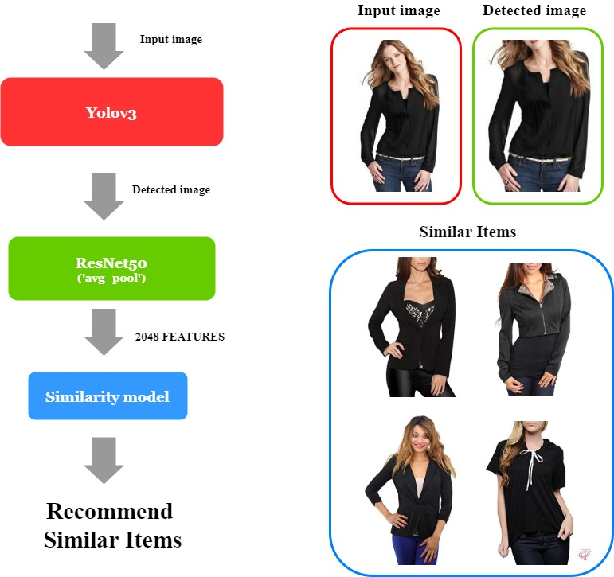
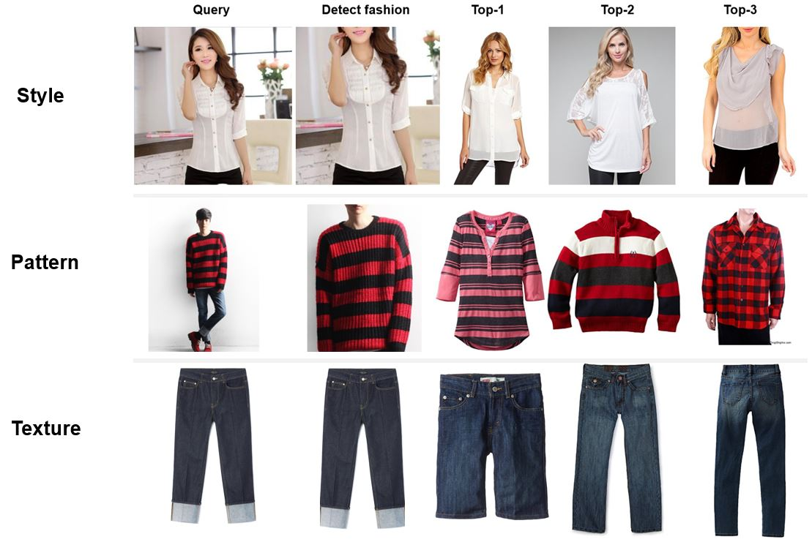
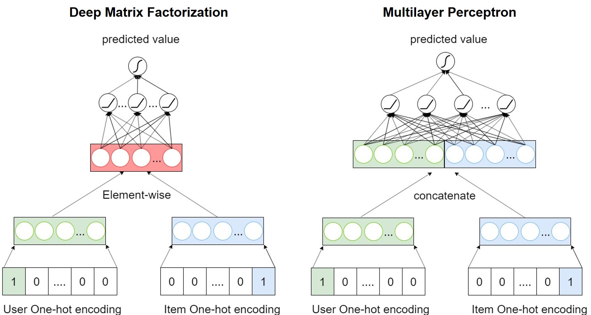
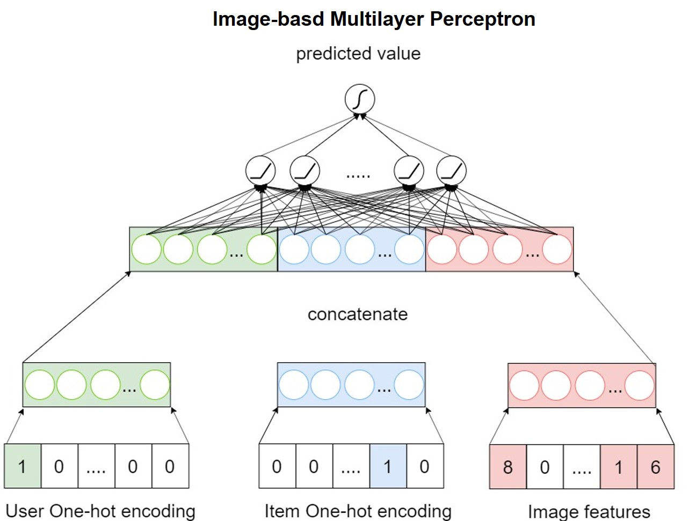
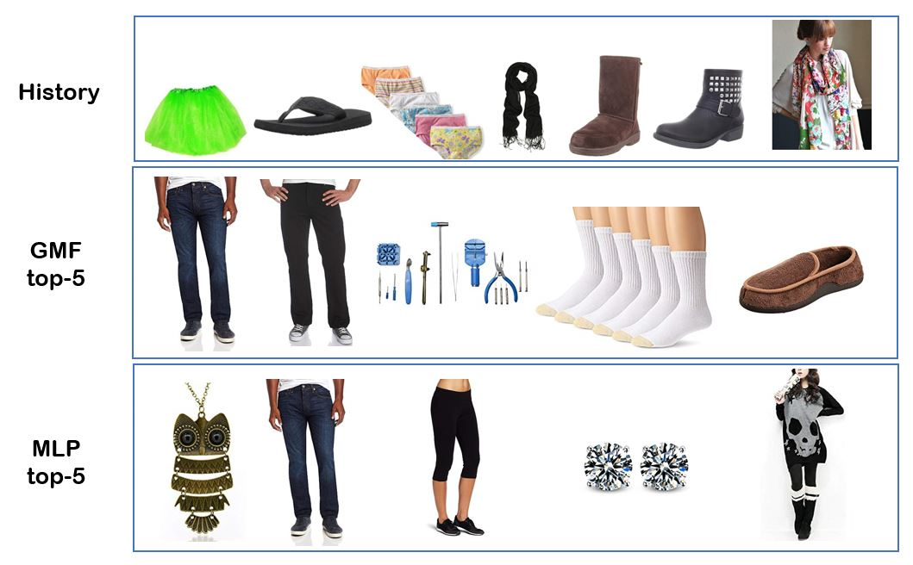

# Personalized Fashion Recommender system
Fast fashion retailers quickly bring designs from the catwalk to consumers, resulting in a daily influx of new clothing options. This can be overwhelming and time-consuming for shoppers trying to find their favorite pieces. A recommender system can address this challenge by providing personalized clothing recommendations based on user preferences.

However, several factors complicate the recommendation process:

Changing Preferences: Fashion trends and individual preferences shift rapidly, making it necessary for the system to adapt accordingly.
Seasonality: Seasonal changes impact clothing choices. For instance, winter requires using data from previous winters to make relevant recommendations.
Aesthetics and Context: The system must consider color coordination and appropriateness for different occasions (e.g., formal wear vs. casual).
Key considerations include:

User Satisfaction with Similar Styles: Users may not appreciate being recommended clothing in the same style, color, or pattern as what they have previously purchased.
Effectiveness of KNN Model: A K-nearest neighbors (KNN) model may not cater to diverse user preferences, leading to suboptimal recommendations.
Image-Based Preference Model: While this approach helps address the cold start problem, it may limit the discovery of new styles that users might also enjoy.


## Similarity based Recommender system

### Similarity Model Architecture

##
### Item Recommendation Example


## Model based Recommender System

### GMF and MLP Model Architecture

##

comming soon
##

### Item Recommendation Example



## Dataset

#### Amazon Datasets-1
- Data for Similarity-based Rs
- AmazonFashion6ImgPartitioned.npy
- Download from https://github.com/kang205/DVBPR

#### Amazon Datasets-2 
- Data for Model-based Rs
- reviews_Clothing_Shoes_and_Jewelry_5.json.gz
- 39387 Users, 23033 Items, 96.92% Sparsity
- Users who rated at least 5 items
- Download from http://jmcauley.ucsd.edu/data/amazon/

#### Amazon Datasets-3
- meta_Clothing_Shoes_and_Jewelry.json.gz
- Download from http://jmcauley.ucsd.edu/data/amazon/

#### Deepfashion dataset
- Data for training yolov3 model
- Download from http://mmlab.ie.cuhk.edu.hk/projects/DeepFashion.html 

## Example Usage

#### Generate data
```
cd preprocessing
python gem_fashion_dataset.py
```
#### Train yolov3, Run Similarity based model

```
cd keras-yolo3-detection
python train.py
```
```
cd model
python similarity_model.py
```

#### Train Model based Rs(you should tuning hyperparameter)
```
cd model
python amazon_MLP.py
python amazon_GMF.py
```
#### Recommendation Items for Users
```
cd model
python mlp_inference.py
python gmf_inference.py
```
```
# output (if you want real product name, use metadata)

User 0's top-10 recommendation
1. B0000C321X
2. B0008EOEPK
3. B000T9VK56
4. B0002TOZ1E
5. B004L7J7IO
6. B005LERHD8
7. B0000WLSCW
8. B000J6ZYL0
9. B000MXIMHI
10. B0013KBX7K
```
## Requirements
```
pip install -r requirements.txt
```

## Path
```

├── Fashion-Recommender-system
    |
    ├── dataset
    |   ├── In-shop_Clothes_Retrieval_Benchmark
    |   |   ├── Anno
    |   |   └── Img
    |   |       ├── MEN
    |   |       └── WOMEN
    |   ├── amazon_clothing_explicit.json
    |   ├── amazon_clothing_fast_implicit.json
    |   ├── reviews_Clothing_Shoes_and_Jewelry_5.json
    |   ├── amazonfashion6_imgfeature.hdf5
    |   ├── AmazonFashion6ImgPartitioned.npy
    |   └── pretrain
    |    
    ├── keras-yolo3-detection
    |
    ├── preprocessing
    |   └── gen_fashion_dataset.py
    |
    ├── AmazonFashion6ImgPartitioned.npy
    |
    ├── img
    |
    ├── jupyter_notebook
    |
    ├── model
    |   ├── similarity_model.py
    |   ├── ...
    |   ├── ...
    |   └── Image_based_MLP.py
    |
    ├── preprocessing
    |   └── gen_fashion_dataset.py
    |
    └── README.md
    
```

